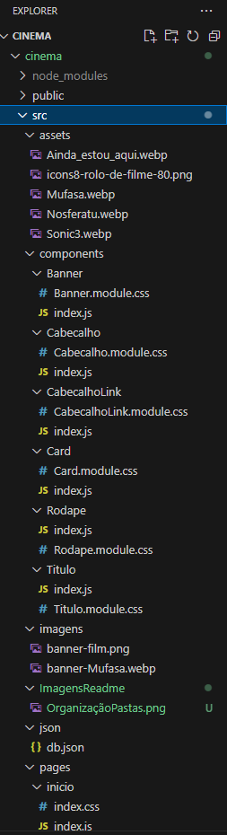

# Cinema

- Desenvolvido por Túlius Alves e Victor Roma

- O site desenvolvido é um portal aonde os visitantes podem acompanhar os filmes em cartaz, aonde é possivel deixar uma avaliação e ver as avaliações de outros usuários.

- A organização das pastas foi feita de forma que é possivel identificar os componentes utilizados para formar a identidade visual do site, as imagens dos banners dos filmes, as paginas do site

- As bibliotecas utilizadas foram

1. reportWebVitals (Usado para medir desempenho da aplicação)
2. BrowswerRouter (Usado para fazer as rotas entre as paginas do site)

- Foram utilizados os seguintes Hooks:

- Barra de navegação desenvolvida para a navegação entre as paginas do site

